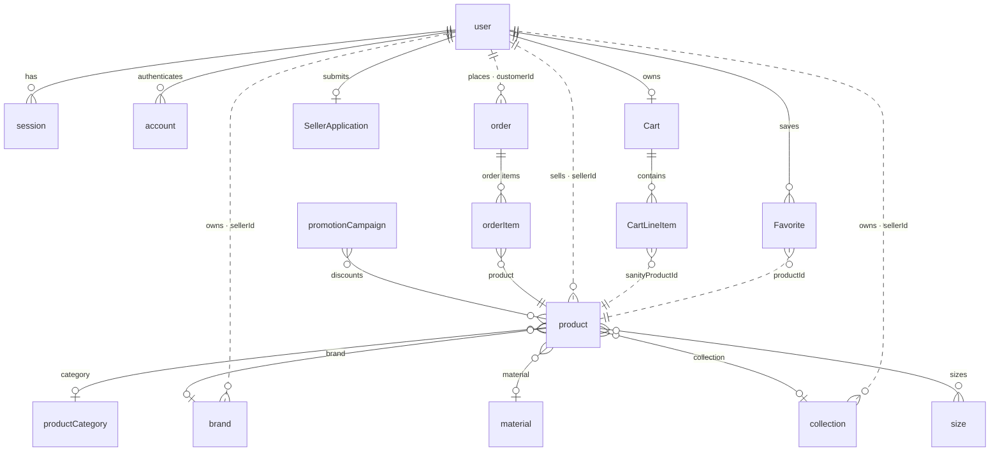

# Data Dictionary — TUDONG.COM

This application stores data across **two systems**:

| Store | Technology | Holds |
|-------|-----------|-------|
| **Relational database** | PostgreSQL (via Prisma ORM) | Identity & authentication, shopping cart, favourites, seller applications |
| **Content database** | Sanity CMS (document store) | Product catalog, taxonomy (categories/brands/materials/sizes/collections), orders, promotions |

The two stores are linked **logically by ID strings**, not by enforced foreign keys.
A Better Auth user ID from the Postgres `user` table appears inside Sanity
documents as `sellerId` (products, brands, collections) and `customerId` (orders);
a Sanity product `_id` appears inside Postgres as `CartLineItem.sanityProductId`
and `Favorite.productId`.

---

## Conventions

**PostgreSQL / Prisma**
- Primary keys are `cuid()` strings generated by the application (except `verification.id`, supplied by Better Auth).
- `String → text`, `Boolean → boolean`, `Int → integer`, `Float → double precision`, `DateTime → timestamp(3)`.
- Some models map to lowercase table names (`@@map`) to match Better Auth's expected schema; the rest use their Prisma model name as the table name.

**Sanity CMS**
- Every document additionally carries system fields: `_id`, `_type`, `_createdAt`, `_updatedAt`, `_rev`. These are omitted from the tables below except where the application relies on them (e.g. `_createdAt` drives the "NEW" product badge; `_id` is referenced cross-store).
- A **reference** field stores `{ _ref: "<document _id>", _type: "reference" }`.
- Sanity has no `NOT NULL` at the database level; "Required" below reflects Studio **validation rules** only.

---

# Part A — PostgreSQL (Prisma)

## `user`  *(model `User`)*
The account record for every person: customers, sellers, and admins.

| Column | Type | Constraints / Default | Description |
|--------|------|-----------------------|-------------|
| `id` | String | **PK**, `cuid()` | Unique user identifier. Referenced by Sanity `sellerId` / `customerId`. |
| `email` | String | **Unique**, required | Login email address. |
| `emailVerified` | Boolean | default `false` | Whether the email has been verified. |
| `name` | String? | nullable | Display name. |
| `image` | String? | nullable | Avatar URL. |
| `role` | String | default `"user"` | Authorisation role: `user`, `seller`, or `admin`. |
| `banned` | Boolean? | default `false` | Whether the account is banned. |
| `banReason` | String? | nullable | Reason for the ban. |
| `banExpires` | DateTime? | nullable | When the ban lifts (null = permanent). |
| `createdAt` | DateTime | default `now()` | Account creation time. |
| `updatedAt` | DateTime | `@updatedAt` | Last modification time. |

**Relationships:** one user has many `session`, many `account`, many `Favorite`; and at most one `Cart` and one `SellerApplication`.

## `session`  *(model `Session`)*
Active login sessions issued by Better Auth.

| Column | Type | Constraints / Default | Description |
|--------|------|-----------------------|-------------|
| `id` | String | **PK**, `cuid()` | Session identifier. |
| `userId` | String | **FK → `user.id`**, `ON DELETE CASCADE`, indexed | Owning user. |
| `token` | String | **Unique** | Session token. |
| `expiresAt` | DateTime | required | Expiry timestamp. |
| `ipAddress` | String? | nullable | Client IP at login. |
| `userAgent` | String? | nullable | Client user-agent string. |
| `createdAt` | DateTime | default `now()` | Session start. |
| `updatedAt` | DateTime | `@updatedAt` | Last refresh. |

## `account`  *(model `Account`)*
Credential / OAuth provider records per user (Better Auth). One user may have several (e.g. password + social).

| Column | Type | Constraints / Default | Description |
|--------|------|-----------------------|-------------|
| `id` | String | **PK**, `cuid()` | Account identifier. |
| `userId` | String | **FK → `user.id`**, `ON DELETE CASCADE`, indexed | Owning user. |
| `accountId` | String | required | Provider-side account ID. |
| `providerId` | String | required | Provider name (e.g. `credential`, `google`). |
| `password` | String? | nullable | Hashed password (credential provider only). |
| `accessToken` | String? | nullable | OAuth access token. |
| `refreshToken` | String? | nullable | OAuth refresh token. |
| `idToken` | String? | nullable | OAuth ID token. |
| `accessTokenExpiresAt` | DateTime? | nullable | Access-token expiry. |
| `refreshTokenExpiresAt` | DateTime? | nullable | Refresh-token expiry. |
| `scope` | String? | nullable | Granted OAuth scopes. |
| `createdAt` | DateTime | default `now()` | Record creation. |
| `updatedAt` | DateTime | `@updatedAt` | Last update. |

## `verification`  *(model `Verification`)*
Short-lived tokens for email verification / password reset (Better Auth).

| Column | Type | Constraints / Default | Description |
|--------|------|-----------------------|-------------|
| `id` | String | **PK** (supplied) | Verification record ID. |
| `identifier` | String | indexed | Subject being verified (e.g. an email). |
| `value` | String | required | The verification token/value. |
| `expiresAt` | DateTime | required | Expiry timestamp. |
| `createdAt` | DateTime | default `now()` | Creation time. |
| `updatedAt` | DateTime | `@updatedAt` | Last update. |

## `Cart`  *(model `Cart`)*
A user's persistent shopping cart. At most one per user.

| Column | Type | Constraints / Default | Description |
|--------|------|-----------------------|-------------|
| `id` | String | **PK**, `cuid()` | Cart identifier. |
| `userId` | String? | **Unique**, **FK → `user.id`**, `ON DELETE CASCADE` | Owning user (nullable to allow guest carts). |
| `createdAt` | DateTime | default `now()` | Creation time. |
| `updatedAt` | DateTime | `@updatedAt` | Last update. |

**Relationships:** one cart has many `CartLineItem`.

## `CartLineItem`  *(model `CartLineItem`)*
A single line in a cart. Product details are **denormalised** (copied in) so the cart survives catalog changes.

| Column | Type | Constraints / Default | Description |
|--------|------|-----------------------|-------------|
| `id` | String | **PK**, `cuid()` | Line-item identifier. |
| `cartId` | String | **FK → `Cart.id`**, `ON DELETE CASCADE`, indexed | Owning cart. |
| `sanityProductId` | String | required | **Cross-store link** to Sanity `product._id`. |
| `quantity` | Int | required | Number of units. |
| `title` | String | required | Product title snapshot. |
| `price` | Float | required | Unit price snapshot (MYR). |
| `image` | String | required | Product image URL snapshot. |

## `Favorite`  *(model `Favorite`)*
A user's wishlist entry (one row per favourited product).

| Column | Type | Constraints / Default | Description |
|--------|------|-----------------------|-------------|
| `id` | String | **PK**, `cuid()` | Favourite identifier. |
| `userId` | String | **FK → `user.id`**, `ON DELETE CASCADE` | Owning user. |
| `productId` | String | required | **Cross-store link** to Sanity `product._id`. |
| `createdAt` | DateTime | default `now()` | When favourited. |

**Constraint:** `@@unique([userId, productId])` — a user cannot favourite the same product twice.

## `SellerApplication`  *(model `SellerApplication`)*
A customer's request to become a seller. At most one per user.

| Column | Type | Constraints / Default | Description |
|--------|------|-----------------------|-------------|
| `id` | String | **PK**, `cuid()` | Application identifier. |
| `userId` | String | **Unique**, **FK → `user.id`**, `ON DELETE CASCADE` | Applicant. |
| `brandName` | String | required | Proposed brand/store name. |
| `description` | String | required | Business description. |
| `instagram` | String? | nullable | Instagram handle/URL. |
| `website` | String? | nullable | Website URL. |
| `status` | `SellerApplicationStatus` | default `PENDING` | Review state (enum below). |
| `createdAt` | DateTime | default `now()` | Submission time. |
| `updatedAt` | DateTime | `@updatedAt` | Last status change. |

### Enum `SellerApplicationStatus`
| Value | Meaning |
|-------|---------|
| `PENDING` | Awaiting admin review (default). |
| `APPROVED` | Approved — user promoted to seller. |
| `REJECTED` | Declined. |

---

# Part B — Sanity CMS

## `productCategory`  *(document)*
Top-level product taxonomy.

| Field | Type | Required | Description |
|-------|------|:-------:|-------------|
| `title` | string | — | Category name (e.g. "Scarves"). |
| `description` | text | — | Category description. |
| `slug` | slug | — | URL segment (e.g. `/category/scarves`). |

## `product`  *(document)*
A catalog item. Owned by a seller via `sellerId`.

| Field | Type | Required | Description |
|-------|------|:-------:|-------------|
| `title` | string | — | Product name. |
| `description` | text | — | Long description. |
| `slug` | slug | ✅ | URL-friendly identifier (max 96 chars, sourced from title). |
| `price` | number | ✅ | List price in MYR (min 0). |
| `image` | array&lt;image&gt; | — | Product photos (hotspot enabled). |
| `category` | reference → `productCategory` | — | Category. |
| `brand` | reference → `brand` | — | Brand. |
| `material` | reference → `material` | — | Material. |
| `collection` | reference → `collection` | — | Collection this belongs to. |
| `color` | array&lt;object&gt; | — | Up to **3** colours; each `{ name: string, hex: string }`. Powers colour-family recommendations. |
| `size` | array&lt;reference → `size`&gt; | — | Available sizes. |
| `stock` | number | — | Units in stock (integer, min 0, default 0). |
| `inStock` | boolean | — | Availability flag (default `true`). |
| `discount` | number | — | Seller-set percentage off list price (0–100). |
| `sellerId` | string | — | **Cross-store link** to `user.id` of the owning seller. |
| `_createdAt` | datetime *(system)* | auto | Creation time — drives the **"NEW" badge** (products < 14 days old). |

## `brand`  *(document)*
A seller's brand identity.

| Field | Type | Required | Description |
|-------|------|:-------:|-------------|
| `name` | string | ✅ | Brand name. |
| `slug` | slug | ✅ | URL segment (sourced from name, max 50). |
| `logo` | image | — | Brand logo. |
| `description` | text | — | Brand description. |
| `sellerId` | string | — | **Cross-store link** to `user.id` of the owning seller. |

## `material`  *(document)*
Material lookup (e.g. cotton, chiffon).

| Field | Type | Required | Description |
|-------|------|:-------:|-------------|
| `name` | string | — | Material name. |
| `description` | text | — | Material description. |

## `size`  *(document)*
Size lookup (e.g. S, M, L).

| Field | Type | Required | Description |
|-------|------|:-------:|-------------|
| `name` | string | — | Size label. |

## `collection`  *(document)*
A seller-curated grouping of products.

| Field | Type | Required | Description |
|-------|------|:-------:|-------------|
| `title` | string | ✅ | Collection name. |
| `slug` | slug | ✅ | URL segment (sourced from title, max 50). |
| `description` | text | — | Collection description. |
| `image` | image | — | Cover image. |
| `sellerId` | string | — | **Cross-store link** to `user.id` of the owning seller. |

## `promotionCampaign`  *(document)*
An admin-run, time-boxed discount applied to selected products.

| Field | Type | Required | Description |
|-------|------|:-------:|-------------|
| `title` | string | ✅ | Campaign name. |
| `description` | text | — | Campaign description. |
| `isActive` | boolean | — | On/off switch (default `true`). |
| `discountType` | string | ✅ | `percentage` or `fixed`. |
| `discountValue` | number | ✅ | Percent (e.g. 20) or fixed RM amount (min 0). |
| `startDate` | datetime | ✅ | Campaign start. |
| `endDate` | datetime | ✅ | Campaign end. |
| `products` | array&lt;reference → `product`&gt; | — | Products the campaign discounts. |

## `promotionCode`  *(document)*
A customer-entered promo code applied at checkout.

| Field | Type | Required | Description |
|-------|------|:-------:|-------------|
| `code` | string | ✅ | Code customers type (forced uppercase, e.g. `HEMAT10`). |
| `isActive` | boolean | — | On/off switch (default `true`). |
| `discountType` | string | ✅ | `percentage` or `fixed`. |
| `discountValue` | number | ✅ | Percent or fixed RM amount (min 0). |
| `expiresAt` | datetime | ✅ | Expiry timestamp. |
| `usageLimit` | number | — | Max redemptions (blank = unlimited). |
| `usageCount` | number | — | Times redeemed (default 0, read-only, managed automatically). |

## `order`  *(document)*
A completed purchase, created by the Stripe webhook on successful payment.

| Field | Type | Required | Description |
|-------|------|:-------:|-------------|
| `orderNumber` | string | — | Human-readable order number. |
| `orderDate` | datetime | — | When the order was placed. |
| `customerId` | string | — | **Cross-store link** to `user.id` of the buyer. |
| `customerName` | string | — | Buyer name snapshot. |
| `customerEmail` | string | — | Buyer email snapshot. |
| `stripeCustomerId` | string | — | Stripe customer ID. |
| `stripeCheckoutSessionId` | string | — | Stripe Checkout Session ID. |
| `stripePaymentIntentId` | string | — | Stripe PaymentIntent ID. |
| `totalPrice` | number | — | Order total in MYR. |
| `shippingAddress` | object `shippingAddress` | — | Delivery address (see below). |
| `orderItems` | array&lt;object `orderItem`&gt; | — | Purchased line items (see below). |
| `trackingNumber` | string | — | Courier tracking number (e.g. Poslaju/J&T). |
| `trackingUrl` | url | — | Courier tracking link. |
| `status` | string | — | `PROCESSING` \| `SHIPPED` \| `DELIVERED` \| `CANCELLED`. |

### Embedded object `shippingAddress`
| Field | Type | Description |
|-------|------|-------------|
| `name` | string | Recipient full name. |
| `line1` | string | Address line 1. |
| `line2` | string | Address line 2. |
| `city` | string | City. |
| `state` | string | State. |
| `postalCode` | string | Postal code. |
| `country` | string | Country. |

### Embedded object `orderItem`
| Field | Type | Description |
|-------|------|-------------|
| `product` | reference → `product` | The purchased product. |
| `quantity` | number | Units purchased. |
| `price` | number | Unit price paid (MYR) at time of purchase. |

---

# Part C — Relationships

### Within PostgreSQL (enforced foreign keys)
- `user` **1 — ∗** `session`, `account`, `Favorite`
- `user` **1 — 0..1** `Cart`, `SellerApplication`
- `Cart` **1 — ∗** `CartLineItem`

### Within Sanity (references)
- `product` **∗ — 1** `productCategory`; **∗ — 0..1** `brand`, `material`, `collection`
- `product` **∗ — ∗** `size`
- `promotionCampaign` **∗ — ∗** `product`
- `order` **1 — ∗** `orderItem` **∗ — 1** `product`

### Cross-store (logical, by ID string — **not** FK-enforced)
| From | Field | To |
|------|-------|----|
| Sanity `product` | `sellerId` | Postgres `user.id` |
| Sanity `brand` | `sellerId` | Postgres `user.id` |
| Sanity `collection` | `sellerId` | Postgres `user.id` |
| Sanity `order` | `customerId` | Postgres `user.id` |
| Postgres `CartLineItem` | `sanityProductId` | Sanity `product._id` |
| Postgres `Favorite` | `productId` | Sanity `product._id` |

### Entity–relationship diagram

> Solid lines = enforced references within one store. Dotted lines = logical cross-store links by ID string.

---

*Generated from `prisma/schema.prisma` and `src/sanity/schemaTypes/schemas/*`. Keep this file in sync when those schemas change.*
